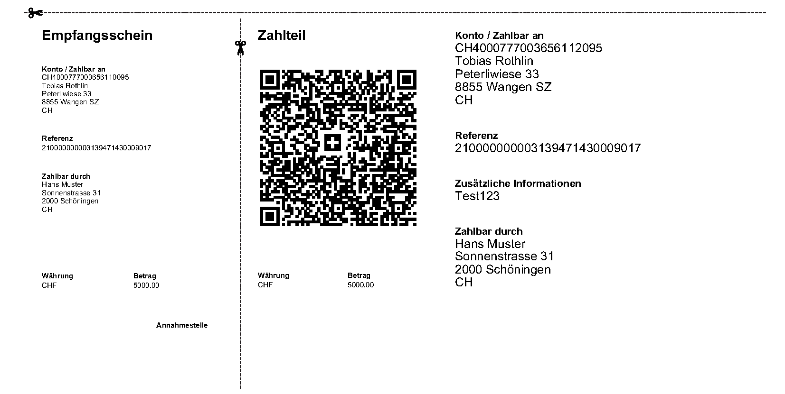

# Swiss QR Invoice Generator
This is a library that can generate swiss QR invoices in pdf or html.


# Installation

if the user wants to use a different html to pdf renderer this can be done by calling the function 
```Python
createQRInvoice(data,returnHTML=True)
``` 
This will return the HTML as a string

## wkthmltopdf

To create the pdf the class uses the [wkhtmltopdf](https://wkhtmltopdf.org) open source (LGPLv3) command line tool.
This tool must be installed on the local machine. 

#### Stable releases: [download](https://wkhtmltopdf.org/downloads.html)

#### Mac OS:
```
brew install homebrew/cask/wkhtmltopdf   
```

## Python Modules
All needed modules should be installed automatically. If not follow the instructions below.

The module pdfkit is used to interface with wkthmltopdf
```
pip install pdfkit
```

To create the QR code the module qrcode is used
```
pip install qrcode
```


The library itself can be installed via pip
```
pip install git+https://github.com/TobiasRothlin/SwissQRInvoiceGenerator.git
```

